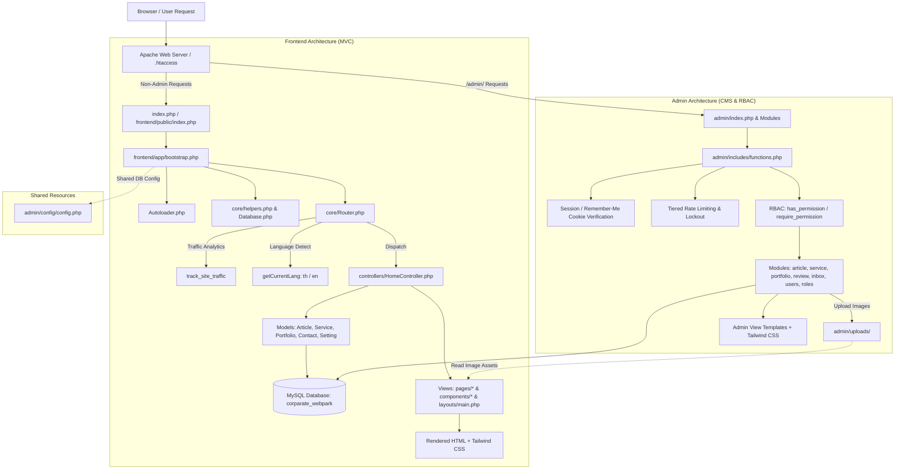
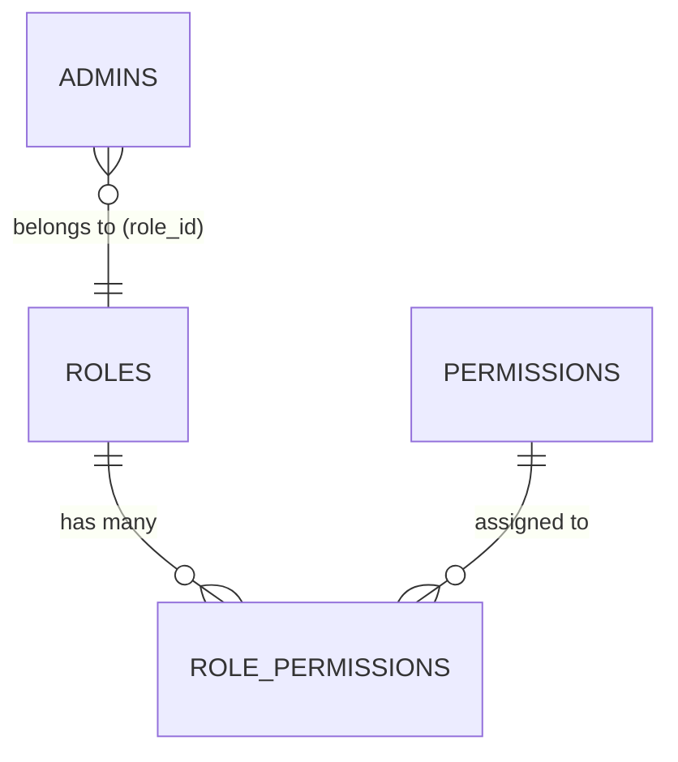

# WEBPARK — Corporate Web Application & CMS Platform

ระบบเว็บแอปพลิเคชันองค์กรและระบบจัดการข้อมูลหลังบ้าน (CMS) ของ **บริษัท เวบปาค จำกัด (WEBPARK Co., Ltd.)** พัฒนาด้วยสถาปัตยกรรม **Lightweight MVC บน Native PHP 8+** พร้อมจัดสไตล์ด้วย **Tailwind CSS v3.x** และเชื่อมต่อฐานข้อมูล **MySQL / MariaDB** ผ่าน **PDO**

> **เป้าหมายของเอกสารฉบับนี้**: เพื่อเป็นคู่มือฉบับสมบูรณ์ (Single Source of Truth) สำหรับนักพัฒนาและทีมงาน ให้เข้าใจภาพรวมสถาปัตยกรรม, การไหลของข้อมูล (Data Flow), ระบบความปลอดภัย, ระบบสิทธิ์ (RBAC), โครงสร้างฐานข้อมูล ตลอดจนการติดตั้งและพัฒนาฟังก์ชันใหม่ต่อได้อย่างราบรื่น

---

## สารบัญ (Table of Contents)

1. [ภาพรวมระบบและเทคโนโลยี (System Overview & Tech Stack)](#1-ภาพรวมระบบและเทคโนโลยี-system-overview--tech-stack)
2. [สถาปัตยกรรมและการเชื่อมต่อ (Architecture & Connection Flow)](#2-สถาปัตยกรรมและการเชื่อมต่อ-architecture--connection-flow)
3. [โครงสร้างโฟลเดอร์ของโปรเจกต์ (Project Structure)](#3-โครงสร้างโฟลเดอร์ของโปรเจกต์-project-structure)
4. [ระบบ Routing และระบบ 2 ภาษา (Routing & Multilingual System)](#4-ระบบ-routing-และระบบ-2-ภาษา-routing--multilingual-system)
5. [ฟังก์ชันการทำงานหลัก (Core Features & Functionalities)](#5-ฟังก์ชันการทำงานหลัก-core-features--functionalities)
   - [5.1 ฝั่งเว็บไซต์สาธารณะ (Frontend Public Site)](#51-ฝั่งเว็บไซต์สาธารณะ-frontend-public-site)
   - [5.2 ฝั่งระบบจัดการหลังบ้าน (Admin CMS & Back Office)](#52-ฝั่งระบบจัดการหลังบ้าน-admin-cms--back-office)
6. [ระบบความปลอดภัยและสิทธิ์การใช้งาน (Security & RBAC System)](#6-ระบบความปลอดภัยและสิทธิ์การใช้งาน-security--rbac-system)
7. [โครงสร้างฐานข้อมูล (Database Schema & Relationships)](#7-โครงสร้างฐานข้อมูล-database-schema--relationships)
8. [คู่มือการติดตั้งและการตั้งค่าระบบ (Setup & Installation Guide)](#8-คู่มือการติดตั้งและการตั้งค่าระบบ-setup--installation-guide)
9. [การ Build Assets และ Tailwind CSS Pipeline](#9-การ-build-assets-และ-tailwind-css-pipeline)
10. [แนวทางการพัฒนาต่อ (Developer Guidelines)](#10-แนวทางการพัฒนาต่อ-developer-guidelines)
11. [การแก้ไขปัญหาที่พบบ่อย (Troubleshooting & FAQs)](#11-การแก้ไขปัญหาที่พบบ่อย-troubleshooting--faqs)

---

## 1. ภาพรวมระบบและเทคโนโลยี (System Overview & Tech Stack)

โปรเจกต์ถูกแบ่งออกเป็น 2 ส่วนหลักที่ทำงานประสานกันผ่านฐานข้อมูลและ Assets เดียวกัน:

1. **Frontend (Public Website)**: เว็บไซต์หลักสำหรับลูกค้าและบุคคลทั่วไป นำเสนอบริการ, ระบบ ERP, ผลงาน (Portfolio), บทความสาระความรู้ (Articles), และฟอร์มติดต่อสอบถามพร้อมระบบตรวจสอบความปลอดภัย
2. **Admin (Back Office CMS & RBAC)**: ระบบบริหารจัดการเนื้อหาสำหรับเจ้าหน้าที่และผู้บริหาร พร้อมระบบควบคุมสิทธิ์ระดับ Action (RBAC), แดชบอร์ดวิเคราะห์สถิติผู้เข้าชมเว็บไซต์, ระบบกล่องข้อความ และเครื่องมือดูแลระบบ

### Technology Stack

| Layer | Technologies & Libraries | รายละเอียด |
| :--- | :--- | :--- |
| **Backend Core** | PHP 8.1+ | Native Lightweight MVC Framework, OOP, Strict Typing |
| **Database** | MySQL 5.7+ / MariaDB 10.4+ | PDO Prepared Statements, UTF-8mb4, Indexing & Foreign Keys |
| **Web Server** | Apache 2.4+ (XAMPP) | URL Rewriting ผ่าน `.htaccess` (Clean URLs) |
| **CSS Framework** | Tailwind CSS v3.4.x | Mobile-first Utility-first CSS, Custom Theme & Components |
| **Frontend Scripting**| Vanilla JavaScript (ES6+) | No heavy runtime, Swiper/Sliders, AJAX Modal & Dynamic Filters |
| **Email Service** | PHPMailer v7.1+ (Composer) | ระบบส่งอีเมลแจ้งเตือนฟอร์มติดต่อ และรหัส OTP รีเซ็ตรหัสผ่าน |
| **Anti-Bot & Security**| Google reCAPTCHA v2 | ป้องกันสแปมในฟอร์มติดต่อหน้าเว็บ |
| **Rich Text Editor** | CKEditor 4 / 5 (CDN) | ตัวแก้ไขเนื้อหาบทความแบบ WYSIWYG รองรับ Image Upload |

---

## 2. สถาปัตยกรรมและการเชื่อมต่อ (Architecture & Connection Flow)

### 2.1 แผนภาพการทำงานและการไหลของข้อมูล (Connection Flow)



### 2.2 การเชื่อมต่อข้อมูลระหว่าง Frontend และ Admin

1. **Shared Database (`corparate_webpark`)**: ทั้งสองฝั่งใช้ฐานข้อมูลเดียวกัน โดย `frontend/app/bootstrap.php` จะดึงค่าคอนฟิกฐานข้อมูลจาก `admin/config/config.php` มาเป็นค่าเริ่มต้น ทำให้ไม่ต้องตั้งค่ารหัสผ่านฐานข้อมูลซ้ำซ้อน
2. **Shared Uploads Directory (`admin/uploads/`)**: 
   - เมื่อ Admin อัปโหลดภาพ (หน้าปกบทความ, ผลงาน, โลโก้ลูกค้า, รูปรีวิว) ไฟล์จะถูกบันทึกไว้ที่ `admin/uploads/`
   - Frontend จะเรียกดูรูปภาพผ่าน Helper `resolve_article_image_url()`, `partner_logo_url()` หรือ `asset_url()` ซึ่งจะแปลง Path ให้ชี้ไปที่ `/Corparate_Webpark/admin/uploads/...` อัตโนมัติ พร้อมรูปภาพ Fallback เมื่อไม่พบไฟล์
3. **Shared System Settings**: ข้อมูลองค์กร (ชื่อบริษัท, เบอร์โทร, อีเมล, ที่อยู่, โซเชียลมีเดีย) ที่แก้ไขจากระบบหลังบ้านในตาราง `company` และ `settings` จะถูกส่งต่อไปแสดงผลที่หน้าบ้าน (Navbar, Footer, Contact Page) ทันที

---

## 3. โครงสร้างโฟลเดอร์ของโปรเจกต์ (Project Structure)

```text
Corparate_Webpark/
├── index.php                             # Root Entry Point -> เรียกต่อ frontend/public/index.php
├── .htaccess                             # Apache Rewrite Rules จัดการ Clean URL และ Routing
├── README.md                             # คู่มือโครงสร้างระบบและคู่มือนักพัฒนา (เอกสารนี้)
├── TODO.md                               # รายการบันทึกงานและฟีเจอร์ที่ต้องทำต่อ
├── composer.json                         # PHP Dependencies (PHPMailer)
├── package.json                          # Root Node configuration
│
├── frontend/                             # ===== ระบบหน้าบ้าน (PUBLIC SITE MVC) =====
│   ├── config.php                        # คอนฟิกหลักของ Frontend (Base URLs, Company Info, reCAPTCHA)
│   ├── routes.php                        # ตารางกำหนดเส้นทาง URL (Route Map)
│   ├── tailwind.config.js                # กำหนดค่า Tailwind CSS ของ Frontend
│   ├── package.json                      # Scripts สำหรับ Build CSS หน้าบ้าน
│   ├── public/                           # โฟลเดอร์ Public Document Root
│   │   ├── index.php                     # Entry Point ฝั่งหน้าบ้าน (โหลด bootstrap.php)
│   │   └── assets/                       # Static Assets หน้าบ้าน
│   │       ├── css/
│   │       │   ├── app.css               # CSS รวม (ก่อน Compile)
│   │       │   ├── tailwind.css          # CSS ผลลัพธ์จากการ Compile (พร้อมใช้งานจริง)
│   │       │   └── partials/             # CSS แยกส่วน (base, detail, home, article)
│   │       ├── js/                       # สคริปต์ JavaScript หน้าบ้าน (main.js, slider, ฯลฯ)
│   │       └── images/                   # รูปภาพประกอบหน้าบ้าน, ไอคอน, โลโก้
│   └── app/                              # MVC Application Core
│       ├── bootstrap.php                 # ไฟล์เริ่มการทำงาน: โหลด Autoload, Session, Config, Router
│       ├── Autoloader.php                # Class Autoloader สำหรับ Controllers และ Models
│       ├── core/                         # คลาสระบบหลัก
│       │   ├── Router.php                # ระบบนำทาง URL, ตัดสินใจเรียก Controller, ติดตามสถิติผู้เข้าชม
│       │   ├── Database.php              # การเชื่อมต่อฐานข้อมูล PDO แบบ Singleton
│       │   └── helpers.php               # ฟังก์ชันตัวช่วยส่วนกลาง (e, route_url, asset_url, CSRF, reCAPTCHA)
│       ├── controllers/
│       │   └── HomeController.php         # Controller หลักสำหรับหน้าเว็บทั้งหมด
│       ├── Models/                       # คลาสจัดการข้อมูลจากตาราง
│       │   ├── Article.php               # จัดการข้อมูลบทความ (ดึงรายการ, แยกหมวดหมู่, นับยอดวิว)
│       │   ├── Service.php               # จัดการข้อมูลบริการและฟีเจอร์ย่อย (service_features)
│       │   ├── Portfolio.php             # จัดการข้อมูลผลงานและเคสศึกษา
│       │   ├── ContactMessage.php        # จัดการบันทึกข้อความติดต่อจากลูกค้า
│       │   ├── Partner.php               # จัดการข้อมูลพาร์ทเนอร์และลูกค้าองค์กร
│       │   ├── Review.php                # จัดการข้อมูลรีวิวจากลูกค้า
│       │   └── Setting.php               # จัดการค่าคอนฟิกส่วนกลาง
│       └── views/                        # Template สำหรับแสดงผล
│           ├── layouts/
│           │   └── main.php              # Layout แม่แบบหลัก (HTML Skeleton, Head, Body, Scripts)
│           ├── components/               # ชิ้นส่วน UI ส่วนกลาง
│           │   ├── navbar.php            # แถบเมนูด้านบนพร้อมปุ่มเปลี่ยนภาษา
│           │   ├── footer.php            # ส่วนท้ายเว็บไซต์พร้อม Sitemap Accordion
│           │   ├── cta.php               # ส่วน Call to Action
│           │   ├── cookie-banner.php     # แถบแจ้งเตือนคุกกี้ (PDPA Consent)
│           │   ├── functions.php         # ฟังก์ชันจัดการภาษา (getCurrentLang, t, loadLanguage)
│           │   ├── lang_th.php           # พจนานุกรมคำแปลภาษาไทย
│           │   └── lang_en.php           # พจนานุกรมคำแปลภาษาอังกฤษ
│           └── pages/                    # หน้าเพจแต่ละหน้า (home, services, erp, article, contact, ฯลฯ)
│
├── admin/                                # ===== ระบบหลังบ้าน (BACK OFFICE CMS & RBAC) =====
│   ├── index.php                         # Front Controller ของ Admin (โหลด dashboard)
│   ├── login.php                         # หน้าเข้าสู่ระบบ (พร้อมระบบ Rate Limit, Lockout และ CSRF)
│   ├── logout.php                        # สคริปต์ออกจากระบบและทำลาย Session
│   ├── dashboard.php                     # แดชบอร์ดหลัก แสดงสถิติ Traffic, บทความ, ผลงาน, ข้อความ Inbox
│   ├── forgot_password.php               # หน้าร้องขอรีเซ็ตรหัสผ่านผ่าน OTP ทางอีเมล
│   ├── reset_password.php                # หน้ายืนยันรหัส OTP และตั้งรหัสผ่านใหม่
│   ├── change_password.php               # หน้าเปลี่ยนรหัสผ่านสำหรับผู้ใช้ที่ล็อกอินอยู่
│   ├── sitemap.php                       # ระบบจัดการ/ตรวจสอบ Sitemap
│   ├── config/                           # ไฟล์การตั้งค่า Admin
│   │   ├── config.php                    # ค่าคงที่ระบบ: DB Credentials, Auth Secret, Mail, Security
│   │   └── database.php                  # การเชื่อมต่อ PDO สำหรับฝั่ง Admin
│   ├── includes/                         # ชิ้นส่วนหน้าจอและฟังก์ชันกลางของ Admin
│   │   ├── header.php                    # แถบด้านบนและ Sidebar เมนู (กรองตามสิทธิ์ RBAC)
│   │   └── footer.php                    # ส่วนท้ายของระบบ Admin
│   │   └── functions.php                 # ศูนย์รวม Helper: RBAC, Upload, Rate Limiter, CSRF, Sanitize
│   ├── database/                         # ไฟล์โครงสร้างและสคริปต์ฐานข้อมูล
│   │   ├── schema.sql                    # โครงสร้างตารางทั้งหมด (Tables, Indexes, Foreign Keys)
│   │   ├── seed.sql                      # ข้อมูลเริ่มต้นระบบ (Admin บัญชีแรก, หมวดหมู่, บริการตัวอย่าง)
│   │   └── migrate_rbac.php              # สคริปต์สร้างตารางและ Seed สิทธิ์สำหรับระบบ RBAC
│   ├── uploads/                          # โฟลเดอร์จัดเก็บไฟล์และรูปภาพที่อัปโหลด
│   ├── assets/                           # CSS/JS ของ Admin (Tailwind)
│   │   ├── css/src/main.css              # ไฟล์ต้นฉบับ CSS
│   │   └── css/dist/tailwind.css         # ไฟล์ CSS หลัง Compile ของ Admin
│   │
│   └── (โฟลเดอร์โมดูลจัดการเนื้อหา CRUD):
│       ├── article/                      # จัดการบทความ (index, create, edit, delete, _form, _save, toggle)
│       ├── category/                     # จัดการหมวดหมู่บทความ
│       ├── service/                      # จัดการบริการหลักและฟีเจอร์ย่อย
│       ├── portfolio/                    # จัดการผลงาน / Case Studies
│       ├── review/                       # จัดการรีวิวและความคิดเห็นลูกค้า
│       ├── partners/                     # จัดการโลโก้พาร์ทเนอร์และลูกค้า
│       ├── contact_inbox/                # จัดการกล่องข้อความติดต่อจากลูกค้า (Inbox)
│       ├── contact/                      # จัดการข้อมูลการติดต่อและข้อมูลบริษัท
│       ├── master/                       # จัดการการตั้งค่าระบบ (Global Settings Key-Value)
│       ├── users/                        # จัดการบัญชีผู้ดูแลระบบ (Admin Accounts)
│       └── roles/                        # จัดการบทบาทและตารางสิทธิ์ (Roles & Permissions Management)
│
└── vendor/                               # Third-party Packages จาก Composer (เช่น PHPMailer)
```

---

## 4. ระบบ Routing และระบบ 2 ภาษา (Routing & Multilingual System)

### 4.1 กลไกการทำงานของ URL (Dual-Language Clean URLs)

ระบบใช้ `.htaccess` ส่ง Request ทั้งหมดเข้าสู่ `frontend/public/index.php` และส่งต่อให้ `Router.php` วิเคราะห์:

1. **รองรับ Clean URLs ภาษาไทยและภาษาอังกฤษ**:
   - ภาษาไทย (Default):
     - `/` → หน้าแรก
     - `/บริการของเรา` → หน้ารวมบริการ
     - `/ระบบ-erp` → หน้าระบบ ERP
     - `/บทความ` → หน้ารวมบทความ
     - `/เกี่ยวกับเรา` → หน้าเกี่ยวกับเรา
     - `/ติดต่อเรา` → หน้าติดต่อเรา
   - ภาษาอังกฤษ (ต่อท้ายด้วย `/en`):
     - `/en` → Homepage ภาษาอังกฤษ
     - `/services/en` → Services Page
     - `/erp/en` → ERP System Page
     - `/article/en` → Articles Page
     - `/about/en` → About Us Page
     - `/contact/en` → Contact Us Page
2. **ระบบถอดรหัสและจับคู่เส้นทาง (Route Normalization)**:
   - ฟังก์ชัน `translate_route_path()` ใน `helpers.php` จะแปลงชื่อภาษาไทยกลับเป็นคีย์ภาษาอังกฤษก่อนนำไป Match กับตารางใน `routes.php`
   - หาก URL ลงท้ายด้วย `/en` ระบบจะตั้งค่าภาษา `$_GET['lang'] = 'en'` และบันทึกลงคุกกี้ให้อัตโนมัติ
3. **รองรับ Dynamic Parameters**:
   - `/article/{slug}` → เรียก `HomeController::article($slug)`
   - `/portfolio/{slug}` → เรียก `HomeController::portfolio($slug)`
   - `/services/{service}` → เรียก `HomeController::serviceDetail($service)`
   - `/services/{service}/{feature}` → เรียก `HomeController::serviceFeature($service, $feature)`
4. **Backward Compatibility**: ยังคงรองรับ Query Parameter รูปแบบเดิม เช่น `?url=article` ผ่าน `resolveRequestPath()`

### 4.2 Helper Functions สำหรับสร้าง URL

- **`route_url(string $path, array $query = []): string`**:
  - สร้างลิงก์ที่ตรงกับภาษาปัจจุบันอัตโนมัติ
  - หากหน้าปัจจุบันเป็นภาษาไทย `route_url('/services')` จะได้ `/Corparate_Webpark/บริการของเรา`
  - หากหน้าปัจจุบันเป็นภาษาอังกฤษ `route_url('/services')` จะได้ `/Corparate_Webpark/services/en`
- **`asset_url(string $path): string`**:
  - ชี้ไปยังไฟล์ใน `frontend/public/assets/...` เช่น `asset_url('images/logo.png')`
- **`resolve_article_image_url(?string $path, string $fallback): string`**:
  - ตรวจสอบไฟล์รูปภาพทั้งใน `admin/uploads/` และ `frontend/public/assets/` พร้อมคืนค่า Fallback Image หากไม่พบไฟล์

### 4.3 ระบบแปลภาษา (i18n Localization Engine)

ไฟล์ทำงาน: `frontend/app/views/components/functions.php`
- **`getCurrentLang(): string`**: ดึงรหัสภาษาปัจจุบัน (`th` หรือ `en`) จาก URL, Query Parameter หรือ Cookie
- **`t(string $key, ?array $replace = null): string`**: เรียกข้อความแปลตามคีย์แบบ Dot-notation เช่น:
  ```php
  echo t('nav.services'); // คืนค่า "บริการของเรา" หรือ "Our Services"
  echo t('home.hero_title');
  ```
- **พจนานุกรมคำแปล**: จัดเก็บใน `lang_th.php` และ `lang_en.php` หากไม่พบคีย์ในภาษาอังกฤษ ระบบจะ Fallback ไปใช้ภาษาไทยอัตโนมัติ

---

## 5. ฟังก์ชันการทำงานหลัก (Core Features & Functionalities)

### 5.1 ฝั่งเว็บไซต์สาธารณะ (Frontend Public Site)

1. **หน้าแรก (Home Page)**:
   - Hero Section พร้อม CTA นำสายตา
   - Grid นำเสนอบริการหลัก (Core Services)
   - แนะนำโซลูชันระบบ ERP สำหรับองค์กร
   - Showcase ผลงานเด่น (Recent Portfolios) พร้อมแท็กเทคโนโลยีที่ใช้
   - เสียงตอบรับและรีวิวจากลูกค้า (Client Testimonials & Ratings)
2. **ระบบบริการและฟีเจอร์ย่อย (Services & Detailed Features)**:
   - หน้ารวมบริการ และหน้าบริการเฉพาะทาง (Digital Platform, Online Marketing, Creative Design)
   - หน้ารายละเอียดฟีเจอร์ย่อยแบบ 2 ระดับ (`/services/{service}/{feature}`) ดึงข้อมูลจากตาราง `service_features`
3. **ระบบนำเสนอ ERP (Enterprise Resource Planning)**:
   - แสดงรายการโมดูล ERP (Accounting, HR, Inventory, CRM ฯลฯ) จากตาราง `erp_modules` พร้อม SVG Icons
4. **ระบบผลงาน (Portfolio & Case Studies)**:
   - แสดงผลงานแยกตามหมวดหมู่ (Website, System, Marketing)
   - หน้ารายละเอียดผลงานระบุชื่อลูกค้า, รายละเอียดงาน, และ Tech Stack
5. **ระบบบล็อกและบทความ (Articles & Knowledge Base)**:
   - แยกตามหมวดหมู่และรองรับการค้นหา
   - **Real-time Pageview Counter**: ระบบนับยอดเปิดอ่านจริง บันทึกลงฟิลด์ `views` ของตาราง `article` (มีระบบป้องกันการนับซ้ำจากการรีเฟรชถี่เกินไป)
   - รองรับเนื้อหาแบบ Rich-text (HTML) และแบบ Multi-section JSON
6. **ฟอร์มติดต่อสอบถาม (Contact Us Form)**:
   - ตรวจสอบความถูกต้องของข้อมูล (ชื่อ-นามสกุล, อีเมล, เบอร์โทรศัพท์ไม่เกิน 10 หลัก)
   - ป้องกันสแปมด้วย **Google reCAPTCHA v2**
   - กล่องยืนยันความยินยอม **PDPA Consent**
   - ส่งอีเมลแจ้งเตือนทีมงานทันทีผ่าน **PHPMailer (SMTP)**
   - บันทึกข้อมูลลงตาราง `contact_messages` พร้อม IP Address และ User Agent
7. **ระบบติดตามสถิติผู้เข้าชมเว็บไซต์ (Site Traffic Tracker)**:
   - บันทึกจำนวนการเปิดหน้า (Pageviews) และผู้เข้าชมไม่ซ้ำรายวัน (Daily Unique Visitors) ลงตาราง `daily_traffic` และ `daily_visitor_logs`
   - **Exclusion**: คัดแยกการเข้าชมของผู้ดูแลระบบ (Super Admin) ออกจากสถิติอัตโนมัติ เพื่อให้ได้ข้อมูลจริงของลูกค้า
8. **SEO & Social Optimization**:
   - ระบบสร้าง Meta Tags, Open Graph (og:title, og:image, og:description) และ Twitter Cards อัตโนมัติทุกหน้า
   - รองรับการกำหนด Meta Title, Keywords และ Description แยกภาษาไทย/อังกฤษ

---

### 5.2 ฝั่งระบบจัดการหลังบ้าน (Admin CMS & Back Office)

1. **แดชบอร์ดสรุปผล (Interactive Dashboard)**:
   - สถิติผู้เข้าชมเว็บไซต์รายวัน/รายเดือน (Pageviews & Unique Visitors)
   - สรุปยอดบทความ, ยอดเข้าชมรวม, จำนวนผลงาน, จำนวนบริการ
   - การแจ้งเตือนข้อความติดต่อใหม่จากลูกค้า (Unread Inbox Messages)
2. **ระบบจัดการบทความและหมวดหมู่ (Articles & Categories)**:
   - เพิ่ม/แก้ไข/ลบ/ซ่อนบทความ พร้อมระบบแท็กและ SEO Meta 2 ภาษา
   - บูรณาการตัวแก้ไขเนื้อหา **CKEditor** รองรับการอัปโหลดรูปภาพแทรกในเนื้อหา
   - จัดการหมวดหมู่แบบลำดับชั้น (รองรับ Sub-categories) และระบบ AJAX Category Modal
3. **ระบบจัดการบริการและฟีเจอร์ (Services & Features)**:
   - จัดการบริการหลัก กำหนด Accent Color, ไอคอน และรูปภาพ
   - จัดการฟีเจอร์ย่อย (Service Features) ที่ผูกกับบริการหลัก
4. **ระบบจัดการผลงาน (Portfolio)**:
   - บันทึกรายละเอียดโปรเจกต์, ระบุลูกค้า, Tech Stack, ภาพหน้าปก และสถานะการเผยแพร่ (Draft / Published)
5. **ระบบจัดการรีวิวลูกค้า (Reviews & Testimonials)**:
   - เพิ่มคำชมจากลูกค้า, ให้คะแนนดาว (Rating 1.0 - 5.0), รูปภาพผู้รีวิว, จัดลำดับการแสดงผล, ปุ่ม Show All / Hide All
6. **ระบบจัดการพาร์ทเนอร์และลูกค้า (Partners & Clients)**:
   - จัดการโลโก้พันธมิตรทางธุรกิจ แยกตามหมวดหมู่พาร์ทเนอร์ (Clients, Tech Partners)
7. **ระบบกล่องข้อความติดต่อ (Contact Inbox)**:
   - แสดงรายการข้อความที่ส่งมาจากหน้าเว็บ
   - ระบบเปลี่ยนสถานะข้อความ: **ใหม่ (`new`)**, **อ่านแล้ว (`read`)**, **ตอบกลับแล้ว (`replied`)**, **จัดเก็บ (`archived`)**
   - แสดงข้อมูลวันเวลา, IP Address และสถานะการส่งอีเมลแจ้งเตือน
8. **ระบบข้อมูลบริษัทและการตั้งค่าระบบ (Company Info & Global Settings)**:
   - ปรับปรุงข้อมูลที่อยู่, เบอร์โทร, เลขประจำตัวผู้เสียภาษี, โลโก้บริษัท
   - กำหนดค่า Global Key-Value Settings (เช่น Social Links, Global Meta, reCAPTCHA keys)
9. **ระบบจัดการผู้ดูแลระบบและบทบาทสิทธิ์ (Users & RBAC Roles)**:
   - เพิ่ม/แก้ไข/ระงับบัญชีผู้ดูแลระบบ
   - สร้างบทบาทใหม่ (Custom Roles) และเปิด/ปิดสิทธิ์ระดับ Action แต่ละโมดูลได้อย่างละเอียด

---

## 6. ระบบความปลอดภัยและสิทธิ์การใช้งาน (Security & RBAC System)

ระบบ Admin มีการวางโครงสร้างความปลอดภัยระดับสูง (Enterprise-grade Security Practices):

### 6.1 การยืนยันตัวตนและความปลอดภัยของ Session
- **Password Hashing**: เข้ารหัสผ่านด้วยฟังก์ชัน `password_hash()` มาตรฐาน **Bcrypt**
- **Remember-Me Protection**: ใช้ HMAC Token (`AUTH_SECRET_KEY`) ที่ปลอดภัย ไม่เก็บรหัสผ่านลงใน Cookie
- **Session Security**: มี Session Timeout (30 นาที), สั่ง `session_regenerate_id(true)` ทุกครั้งที่เปลี่ยนสถานะสิทธิ์ และตั้งค่าคุกกี้แบบ `HttpOnly`, `SameSite=Strict`
- **CSRF Token Protection**: ป้องกันการโจมตีแบบ Cross-Site Request Forgery ทุกฟอร์มผ่านฟังก์ชัน `csrf_field()`, `csrf_token()` และ `csrf_verify()`

### 6.2 ระบบป้องกันการสุ่มรหัสผ่าน (Tiered Rate Limiting & Lockout)
- ตรวจจับความพยายามล็อกอินผิดพลาดแยกตาม Client IP และ Username
- **ลำดับขั้นการระงับสิทธิ์ (Tiered Lockout)**:
  - ผิดพลาด 3 ครั้งแรก: ระงับการล็อกอินชั่วคราวเป็นเวลา 6 นาที (360 วินาที)
  - หากยังผิดพลาดต่อเนื่อง: เพิ่มระยะเวลาการถูกระงับเป็นทวีคูณ (15 นาที, 30 นาที, 1 ชั่วโมง)
  - ผิดพลาดเกินเกณฑ์สูงสุด: ระบบจะทำการระงับแบบถาวร (Permanent Lockout) ต้องติดต่อ Super Admin หรือใช้โทเคนปลดล็อก
- สามารถปลดล็อกกรณีฉุกเฉินบน Localhost ผ่าน URL: `admin/login.php?reset_rate_limit=1`

### 6.3 ระบบกู้คืนรหัสผ่านด้วย OTP ทางอีเมล (Forgot Password Flow)
1. ผู้ใช้กรอก Username หรือ Email ในหน้า `admin/forgot_password.php`
2. ระบบตรวจสอบตัวตนและสุ่มรหัส **OTP 6 หลัก** (มีอายุใช้งาน 15 นาที)
3. ส่งรหัส OTP ไปยังอีเมลของผู้ดูแลระบบผ่าน **PHPMailer (SMTP)**
4. นำรหัส OTP มายืนยันที่หน้า `admin/reset_password.php` เพื่อตั้งรหัสผ่านใหม่

### 6.4 ระบบควบคุมสิทธิ์การใช้งานตามบทบาท (Dynamic RBAC)

ระบบใช้ตาราง 3 ตารางในการควบคุมสิทธิ์: `roles`, `permissions`, และ `role_permissions`



#### บทบาทเริ่มต้นในระบบ (Default Roles)
1. **ผู้ดูแลระบบสูงสุด (Super Admin - `super_admin`)**: มีสิทธิ์เข้าถึง จัดการ แก้ไข และลบข้อมูลทุกอย่างในระบบ รวมถึงการจัดการผู้ใช้และบทบาทสิทธิ์
2. **ผู้จัดการฝ่ายเนื้อหา (Content Manager - `content_manager`)**: จัดการบทความ, หมวดหมู่, ผลงาน, รีวิว, บริการ, ลูกค้า และดูแลกล่องข้อความติดต่อ
3. **เจ้าหน้าที่เขียนบทความ (Editor - `editor`)**: ดู สร้าง และแก้ไขบทความ หมวดหมู่ และผลงาน (ไม่มีสิทธิ์ลบ)
4. **เจ้าหน้าที่บริการลูกค้า (Support - `support`)**: ดูและอัปเดตสถานะข้อความจากลูกค้าใน Contact Inbox
5. **ผู้เข้าชมข้อมูล (Viewer - `viewer`)**: ดูรายการข้อมูลต่างๆ ในระบบได้อย่างเดียว (Read-only)

#### การตรวจสอบสิทธิ์ในโค้ด (Permission Checking)
```php
// ตรวจสอบสิทธิ์ก่อนแสดงปุ่มหรือเข้าถึงหน้าจอ
if (has_permission('article.create')) {
    // แสดงปุ่มเพิ่มบทความ
}

// บังคับสิทธิ์ หากไม่มีสิทธิ์จะถูกปฏิเสธและแสดงข้อความแจ้งเตือนทันที
require_permission('article.delete');
```

---

## 7. โครงสร้างฐานข้อมูล (Database Schema & Relationships)

ชื่อฐานข้อมูลมาตรฐาน: **`corparate_webpark`** (Collation: `utf8mb4_unicode_ci`)

### สรุปรายการตารางในระบบ

| กลุ่มตาราง | ชื่อตาราง | คำอธิบาย |
| :--- | :--- | :--- |
| **ระบบสิทธิ์และผู้ใช้** | `admins` | บัญชีผู้ดูแลระบบ (Username, Email, Password Hash, Role ID) |
| | `roles` | ตารางบทบาทผู้ใช้ (Super Admin, Editor, ฯลฯ) |
| | `permissions` | รายการสิทธิ์ทั้งหมดในระบบ แยกตาม Module และ Action |
| | `role_permissions` | ตารางจับคู่สิทธิ์การใช้งานของแต่ละบทบาท |
| **บทความและหมวดหมู่** | `article` | เนื้อหาบทความ, Cover Image, Views Counter, SEO Meta 2 ภาษา |
| | `categories` | หมวดหมู่บทความและผลงาน (รองรับ `parent_id` สำหรับ Sub-category) |
| | `authors` | ข้อมูลผู้เขียนบทความและทีมงาน |
| **บริการและ ERP** | `service` | บริการหลักของบริษัท, สรุปรายละเอียด, Theme Color, รูปภาพ |
| | `service_features`| ฟีเจอร์ย่อยของแต่ละบริการ (เชื่อมโยงกับ `service.id` แบบ Cascade Delete) |
| | `erp_modules` | โมดูลระบบ ERP ที่บริษัทให้บริการ พร้อม SVG Code |
| **ผลงานและลูกค้า** | `portfolio` | ผลงานและเคสศึกษา, Client Name, Tech Stack, Cover Image |
| | `review` | รีวิวและความคิดเห็นจากลูกค้า, Rating ดาว (1.0 - 5.0) |
| | `partners` | รายชื่อและโลโก้พาร์ทเนอร์/ลูกค้าองค์กร |
| | `partner_categories`| หมวดหมู่พาร์ทเนอร์ (Clients, Tech Partners) |
| **การติดต่อและการตั้งค่า**| `contact_messages`| ข้อความติดต่อจากลูกค้าหน้าเว็บ, สถานะ, PDPA Consent, IP Address |
| | `company` | ข้อมูลบริษัท (ชื่อ, ที่อยู่, เบอร์โทร, เลขประจำตัวผู้เสียภาษี, โลโก้) |
| | `settings` | การตั้งค่าระบบแบบ Key-Value Pair (Global Config) |
| **สถิติและการเข้าชม** | `daily_traffic` | สถิติรายวัน: จำนวนเปิดหน้า (Pageviews) และผู้เข้าชมไม่ซ้ำ (Unique Visitors) |
| | `daily_visitor_logs`| บันทึก Hash ผู้เข้าชมรายวัน เพื่อป้องกันการนับผู้เข้าชมซ้ำ |

---

## 8. คู่มือการติดตั้งและการตั้งค่าระบบ (Setup & Installation Guide)

### 8.1 สิ่งที่ต้องมีในเครื่อง (Prerequisites)
- **เว็บเซิร์ฟเวอร์**: [XAMPP](https://www.apachefriends.org/) (Apache + MySQL/MariaDB) พร้อมเปิดโมดูล `mod_rewrite`
- **PHP**: เวอร์ชัน 8.1 ขึ้นไป (แนะนำ PHP 8.2)
- **Node.js & npm**: เวอร์ชัน 18+ หรือ 20+ (สำหรับ Compile Tailwind CSS)
- **Composer**: สำหรับติดตั้งหรืออัปเดต PHP Dependencies

### 8.2 การติดตั้ง Source Code
วางโฟลเดอร์โปรเจกต์ไว้ที่ไดเรกทอรี `htdocs` ของ XAMPP:
```text
C:\xampp\htdocs\Corparate_Webpark\
```

### 8.3 การสร้างและนำเข้าฐานข้อมูล (Database Setup)

1. เปิดโปรแกรม **XAMPP Control Panel** แล้วกด **Start** ที่โมดูล **Apache** และ **MySQL**
2. เปิดเบราว์เซอร์ไปที่ `http://localhost/phpmyadmin/`
3. สร้างฐานข้อมูลใหม่ชื่อ: **`corparate_webpark`** (Collation: `utf8mb4_unicode_ci`)
4. นำเข้าไฟล์ฐานข้อมูลตามลำดับดังนี้:
   - นำเข้าไฟล์: `admin/database/schema.sql` (สร้างโครงสร้างตารางหลัก)
   - นำเข้าไฟล์: `admin/database/seed.sql` (นำเข้าข้อมูลตั้งต้น)
5. เปิด Terminal หรือ Command Prompt ที่โฟลเดอร์โปรเจกต์ แล้วรันคำสั่ง Migration สำหรับระบบสิทธิ์และสถิติ:
   ```bash
   php admin/database/migrate_rbac.php
   php admin/migrate_stats.php
   php admin/migrate_traffic_logs.php
   ```

### 8.4 การตั้งค่าคอนฟิกูเรชัน (Configuration)

#### 1. คอนฟิกฐานข้อมูลและระบบ Admin (`admin/config/config.php`)
ตรวจดูค่าการเชื่อมต่อฐานข้อมูล:
```php
define('DB_HOST', '127.0.0.1');
define('DB_NAME', 'corparate_webpark');
define('DB_USER', 'root');
define('DB_PASS', ''); // รหัสผ่าน MySQL (XAMPP ค่าเริ่มต้นคือค่าว่าง)
define('DB_PORT', '3306');
define('DB_CHARSET', 'utf8mb4');
```

#### 2. คอนฟิก Base URL หน้าบ้าน (`frontend/config.php`)
ตรวจสอบว่า `base_url` ตรงกับชื่อโฟลเดอร์ใน `htdocs`:
```php
'app' => [
    'name' => 'webpark',
    'base_url' => '/Corparate_Webpark',
    'asset_base_url' => '/Corparate_Webpark/frontend/public',
],
```

#### 3. การตั้งค่าระบบส่งอีเมล (SMTP / Mail Configuration)
หากต้องการทดสอบระบบส่งอีเมลแจ้งเตือนฟอร์มติดต่อ หรือ OTP ให้กำหนด Environment Variables หรือแก้ไขใน `admin/config/config.php`:
```php
define('MAIL_HOST', getenv('MAIL_HOST') ?: 'smtp.gmail.com');
define('MAIL_PORT', (int)(getenv('MAIL_PORT') ?: 587));
define('MAIL_USER', getenv('MAIL_USER') ?: 'your-email@gmail.com');
define('MAIL_PASS', getenv('MAIL_PASS') ?: 'your-app-password');
```

#### 4. การตั้งค่า Google reCAPTCHA v2
ค่าเริ่มต้นจะมี Test Site Key มาให้แล้ว หากต้องการใช้ Secret Key สำหรับตรวจสอบจริง สามารถกำหนดใน Environment หรือ `admin/config/config.php`:
```php
define('RECAPTCHA_SITE_KEY', '6Lcf_pAtAAAAAOVhatPPwrHSYXeb_0J4yXf5BrRO');
define('RECAPTCHA_SECRET_KEY', 'your-secret-key-here');
```
*(หมายเหตุ: บน Localhost หากยังไม่ได้ตั้งค่า Secret Key ระบบจะอนุญาตให้ผ่านได้อัตโนมัติเพื่อความสะดวกในการทดสอบ)*

### 8.5 การเข้าใช้งานระบบ

- **หน้าบ้าน (Frontend Public Site)**:
  `http://localhost/Corparate_Webpark/`
- **ระบบหลังบ้าน (Admin CMS Portal)**:
  `http://localhost/Corparate_Webpark/admin/login.php`

#### ข้อมูลบัญชีผู้ดูแลระบบเริ่มต้น (Default Admin Credentials):
- **Username**: `admin_webpark`
- **Password**: `password`
- **สิทธิ์**: ผู้ดูแลระบบสูงสุด (Super Admin)

---

## 9. การ Build Assets และ Tailwind CSS Pipeline

โปรเจกต์แยกการจัดการสไตล์ Tailwind CSS ระหว่าง Frontend และ Admin เพื่อประสิทธิภาพและความเป็นอิสระต่อกัน:

### 9.1 Frontend Tailwind CSS
1. เข้าไปยังโฟลเดอร์ `frontend`:
   ```bash
   cd frontend
   npm install
   ```
2. คำสั่ง Build สำหรับ Frontend:
   ```bash
   # รวมไฟล์ partials และ Compile Tailwind CSS แบบย่อขนาด (Production)
   npm run build:css

   # โหมดเฝ้าดูการเปลี่ยนแปลงไฟล์อัตโนมัติ (Development)
   npm run watch:css
   ```
   *โครงสร้าง Partial CSS*: ไฟล์ต้นทางอยู่ที่ `frontend/public/assets/css/partials/` (base, detail, home, article) จะถูกรวมเข้าเป็น `app.css` แล้วคอมไพล์ออกมาเป็น `frontend/public/assets/css/tailwind.css`

### 9.2 Admin Tailwind CSS
1. เข้าไปยังโฟลเดอร์ `admin`:
   ```bash
   cd admin
   npm install
   ```
2. คำสั่ง Build สำหรับ Admin:
   ```bash
   # Compile Tailwind CSS สำหรับ Admin
   npm run tailwind:build

   # โหมดเฝ้าดูการเปลี่ยนแปลงไฟล์ของ Admin
   npm run tailwind:watch
   ```
   *ผลลัพธ์*: บันทึกไปยัง `admin/assets/css/dist/tailwind.css`

---

## 10. แนวทางการพัฒนาต่อ (Developer Guidelines)

### 10.1 วิธีการเพิ่มหน้าเพจใหม่ใน Frontend
1. **กำหนด Route**: เพิ่มเส้นทางใน `frontend/routes.php`:
   ```php
   '/careers' => [HomeController::class, 'careers'],
   ```
2. **สร้าง Method ใน Controller**: เพิ่มฟังก์ชันใน `frontend/app/controllers/HomeController.php`:
   ```php
   public function careers(): void
   {
       $this->render('careers', [
           'title' => 'ร่วมงานกับเรา | WEBPARK',
           'metaDescription' => 'ตำแหน่งงานที่เปิดรับสมัคร...',
       ]);
   }
   ```
3. **สร้าง View**: สร้างไฟล์ `frontend/app/views/pages/careers.php` โดย View นี้จะถูกครอบด้วย `frontend/app/views/layouts/main.php` อัตโนมัติ

### 10.2 วิธีการเพิ่มโมดูลใหม่ในระบบ Admin
1. สร้างโฟลเดอร์โมดูลใหม่ใน `admin/` เช่น `admin/careers/`
2. สร้างไฟล์ CRUD: `index.php`, `create.php`, `edit.php`, `delete.php`, `_form.php`, `_save.php`
3. กำหนดสิทธิ์ RBAC:
   - เพิ่มรายการ Action ในตาราง `permissions` (เช่น `careers.view`, `careers.create`, `careers.edit`, `careers.delete`)
   - ในหน้า PHP ของโมดูล ให้ดักจับสิทธิ์:
     ```php
     require_once __DIR__ . '/../includes/functions.php';
     require_login();
     require_permission('careers.view');
     ```
4. ผูกฟอร์มด้วย CSRF Protection:
   ```html
   <form action="_save.php" method="POST">
       <?= csrf_field() ?>
       <!-- ฟิลด์ข้อมูล -->
   </form>
   ```
5. จัดการ Upload รูปภาพด้วย `handle_upload('cover_image')` ใน `functions.php`

### 10.3 กฎความปลอดภัยที่ต้องปฏิบัติตามเสมอ (Mandatory Security Rules)
- **ป้องกัน XSS**: แสดงผลข้อความจากผู้ใช้หรือฐานข้อมูลผ่านฟังก์ชัน `e($value)` หรือ `htmlspecialchars()` เสมอ
- **ป้องกัน SQL Injection**: ใช้ **PDO Prepared Statements** (เช่น `$stmt = db()->prepare(...)` และ `$stmt->execute([...])`) ห้ามนำตัวแปรต่อสตริง SQL โดยตรง
- **ป้องกัน CSRF**: ทุกคำขอที่ส่งแบบ POST ต้องผ่านการตรวจสอบ `csrf_verify()`

---

## 11. การแก้ไขปัญหาที่พบบ่อย (Troubleshooting & FAQs)

### Q1: เปิดหน้าเว็บแล้วขึ้น Error 404 เมื่อกดไปยังหน้าอื่นๆ
- **สาเหตุ**: Apache ยังไม่ได้เปิดใช้งานโมดูล `mod_rewrite` หรือการตั้งค่า `AllowOverride` ใน Apache ถูกปิดอยู่
- **วิธีแก้**:
  1. เปิดไฟล์ `httpd.conf` ของ Apache ใน XAMPP
  2. ค้นหาและเอาเครื่องหมาย `#` หน้าบรรทัดนี้ออก:
     ```apache
     LoadModule rewrite_module modules/mod_rewrite.so
     ```
  3. ตรวจสอบให้แน่ใจว่าในส่วน `<Directory "c:/xampp/htdocs">` มีการตั้งค่า:
     ```apache
     AllowOverride All
     ```
  4. สั่ง Restart Apache ใน XAMPP Control Panel

### Q2: ล็อกอินเข้าระบบ Admin ไม่ได้ หรือขึ้นเตือนว่าระบบถูกระงับ (Rate Limited / Locked Out)
- **สาเหตุ**: มีการกรอกรหัสผ่านผิดเกิน 3 ครั้ง ระบบความปลอดภัยจึงทำการระงับชั่วคราว
- **วิธีแก้**:
  - สำหรับการทดสอบในเครื่อง Developer สามารถปลดล็อกได้ทันทีโดยการเปิด URL:
    `http://localhost/Corparate_Webpark/admin/login.php?reset_rate_limit=1`
  - หรือลบไฟล์แคชการระงับสิทธิ์ที่ถูกสร้างขึ้นใน `sys_get_temp_dir()` (ไฟล์ขึ้นต้นด้วย `wbpk_rl_`)

### Q3: รูปภาพที่อัปโหลดไม่แสดงผล หรือลิงก์ CSS เพี้ยน
- **สาเหตุ**: ค่า `base_url` ใน `frontend/config.php` หรือ `SITE_URL` ใน `admin/config/config.php` ไม่ตรงกับชื่อโฟลเดอร์ในเครื่องจริง
- **วิธีแก้**:
  - ตรวจสอบว่าชื่อโฟลเดอร์โปรเจกต์ใน `htdocs` สะกดด้วยตัวพิมพ์เล็ก-ใหญ่ตรงกัน: `Corparate_Webpark`
  - ตรวจสอบ `app.base_url` ใน `frontend/config.php` ให้เป็น `/Corparate_Webpark`
  - ตรวจสอบสิทธิ์การเขียนไฟล์ (Write Permission) ของโฟลเดอร์ `admin/uploads/`

### Q4: ทำการแก้ไขไฟล์ CSS แล้วแต่หน้าเว็บยังคงแสดงผลแบบเดิม
- **สาเหตุ**: Tailwind CSS ยังไม่ได้ถูก Compile ใหม่ หรือเบราว์เซอร์จำแคชไฟล์เก่า
- **วิธีแก้**:
  1. รันคำสั่ง `npm run build:css` ในโฟลเดอร์ `frontend/`
  2. กด `Ctrl + F5` (Windows) หรือ `Cmd + Shift + R` (Mac) บนเบราว์เซอร์เพื่อ Hard Reload ล้างแคช

---

## สมาชิกทีมและผู้พัฒนา (Credits & License)

- **ผู้พัฒนา**: ทีมพัฒนาระบบ บริษัท เวบปาค จำกัด (WEBPARK Co., Ltd.)
- **ที่อยู่**: 525/89 ซอยลาดพร้าว 126 แขวงพลับพลา เขตวังทองหลาง กรุงเทพฯ 10310
- **เว็บไซต์**: [webpark.co.th](https://webpark.co.th) | **อีเมล**: `info@webpark.co.th`
- **ลิขสิทธิ์**: สงวนลิขสิทธิ์ตามกฎหมาย © 2026 WEBPARK Co., Ltd.
